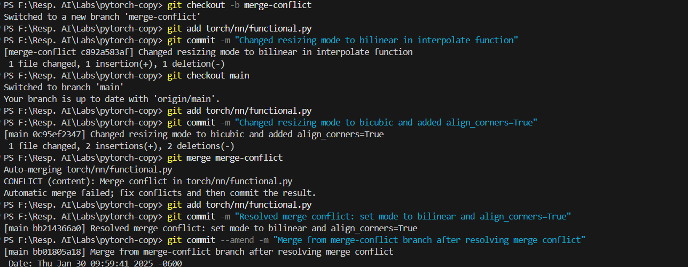
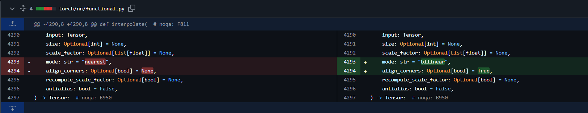
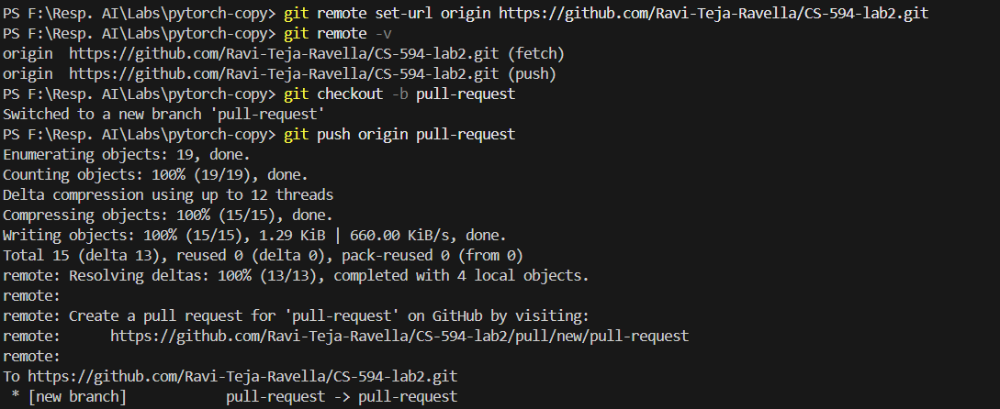
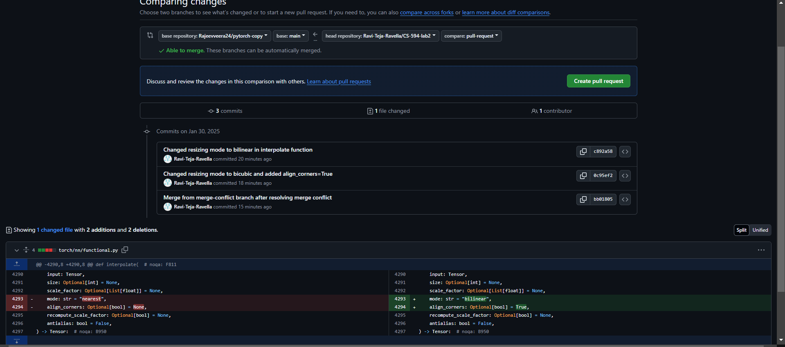
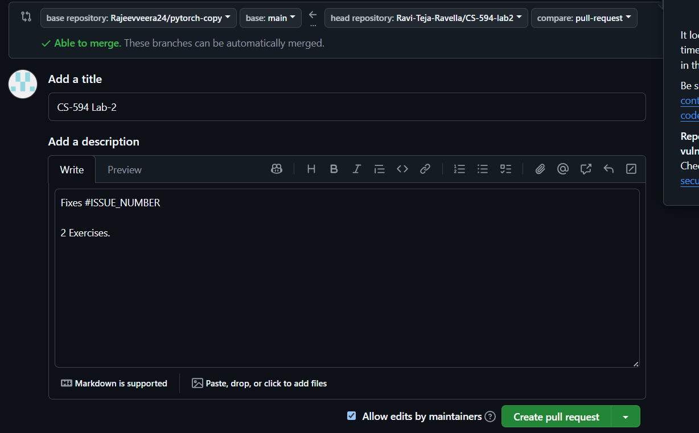

# Deliverables Overview - Ravi Teja Ravella

## 1. Create and fix a merge conflict locally. Then, amend the merge commit to state that a merge conflict was resolved.

---

## 2. Raise a pull request with your new changes. Show the the url of the pull request to a TA.

url for the successful pull request: https://github.com/Rajeevveera24/pytorch-copy/pull/127

---
## 3. Explain to a TA the difference between a cloned and forked repository, when you would use each, and why we use pull requests.

### Cloning a repository
-Creates a local copy of a repository.

-Maintains a direct connection to the original repository.

-Used when we have write access or just need a local copy.

-No need for a pull request if you have access.

- We can clone a repository and work on it if we have a write access to that repository. More likely a private team project.

### Forking a repository
-Creates a separate copy under ones own GitHub account.

-Is used when we don’t have write access but want to contribute.

-It allows us to experiment without affecting the original repository.

-Requires a pull request to merge changes back.

- We can fork a repository when we don't have a write access to that repository or if we are going to work on something individually before suggesting any changs to the repository owner regarding any project.

### Why we use pull requests
-It allows review and approval before merging.

-Doing this, it encourages collaboration by discussing changes.

-Keeps the main branch stable and free from errors.

-Maintains clear version control for tracking contributions.

-Ensures safe contributions without modifying the main repo directly.
### Summary

This is a copy of [https://github.com/pytorch/pytorch](https://github.com/pytorch/pytorch). 

The repository was used to demonstrate basic git and github concepts to students taking course [17645 - Machine Learning in Production](https://mlip-cmu.github.io/f2024/) in Fall 2024 at Carnegie Mellon University. I was the teaching assistant in charge of this lab assignment.

The exact details of the assignment can be found here - [https://github.com/mlip-cmu/f2024/blob/main/labs/lab03.md](https://github.com/mlip-cmu/f2024/blob/main/labs/lab03.md)
